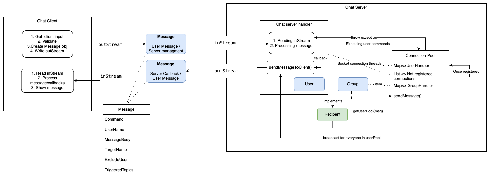

# CS3524-Assessment 📁

This project is a command-line based messenger system developed as part of our CS3524 Programming Assessment. It supports real-time communication between multiple clients via a central server using socket programming.

---

## Project Architecture

## Project Structure

<pre> 
<strong>src</strong>/
└── <strong>main</strong>/
    └── <strong>java</strong>/
        ├── <strong>client</strong>/                        # Client-side classes and user interaction
        |   ├── <strong>ChatClient.java</strong>            Connects to server, sends/receives messages, handles user input.
        |   └── <strong>StartClient.java</strong>           Launches the client.
        |
        ├── <strong>server</strong>/                        # Server-side classes and logic
        |   ├── <strong>ChatServer.java</strong>            Listens for clients and accepts connections.
        |   ├── <strong>ChatServerHandler.java</strong>     Handles each client in a separate thread.
        |   ├── <strong>ConnectionPool.java</strong>        Manages users, groups, and message routing.
        |   └── <strong>StartChatServer.java</strong>       Starts the server.
        |
        ├── <strong>objects</strong>/                       # Shared data structures (e.g., Message, User, Group)
        |   ├── <strong>Command.java</strong>               Enum of available commands.
        |   ├── <strong>Message.java</strong>               Serializable message object for communication.
        |   ├── <strong>Recipient.java</strong>             Interface for general recipient behavior.
        |   ├── <strong>Group.java</strong>                 Group defined class.
        |   └── <strong>User.java</strong>                  User defined class
        |
        └── <strong>exceptions</strong>/                    # Custom exception classes
            ├── <strong>ChatExceptions.java</strong>        Custom Client side exceptions.
            └── <strong>ServerExceptions.java</strong>      Custom Server side exceptions.
</pre>

---

## How to Compile and Run (In Terminal): 🚀

1. Navigate to the Java source directory

>cd src/main/java

2. Compile the project

>javac server/*.java client/*.java objects/*.java exceptions/*.java

3. Start the Chat Server

>java server.StartChatServer

4. Start a client (in a separate terminal)

>java client.StartClient

You can open multiple terminals to add more clients.

## Available Commands: 💬

### General commands: 🔧
 
- REGISTER <user_name>             Register with a unique username.
- UNREGISTER                       Unregister and disconnect from the server.
- USERS                            Show all online users.
- HELP                             Show all available commands.

### Groups: 👥

- GROUPS                           List all groups.
- CREATE <group_name>              Create a group.
- REMOVE <group_name>              Remove a group you own.
- JOIN <group_name>                Join a group.
- LEAVE <group_name>               Leave a group.
- MEMBERS <group_name>             List of members of this group.

### Messaging: ✉️

- SEND <recipient> <message>         Send message to a user or group.
- SEND global <message>              Broadcast message to everyone.

### Topics: 🧵
  
- TOPIC <group> <topic>                 Create/register a topic in a group.
- TOPICS <group>                        List topics in a group.
- SUBSCRIBE <group> <topic>             Subscribe to a topic.
- UNSUBSCRIBE <group> <topic>           Unsubscribe from a topic.

### Hashtags shortcut: 🔖

Messages that have hashtags (ex. #music) will automatically register those as topics in the relevant group

For example; SEND <group_name> I'm into #AI and #Gaming these days

### NOTES: 📌

- Topic subscriptions are group-specific 
- Messages with topics are only delivered to subscribed users in the same group
- Exiting a client will clean up all resources and unregister that user from the server

## Our assignment features;

- One-to-one and group messaging                                    ✅
- Client Registration and unregistration                            ✅
- Broadcast (global) messages                                       ✅
- Group management                                                  ✅
- Topic-based message delivery                                      ✅
- Hashtag parsing for topics                                        ✅
- Server data backup after execution.                               ✅
